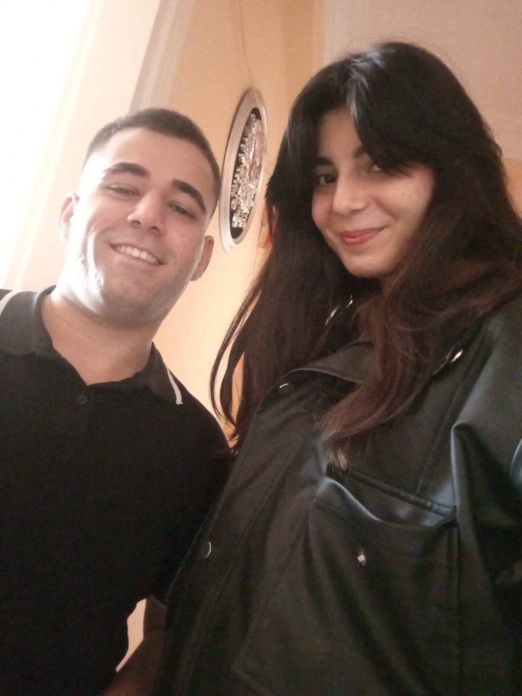
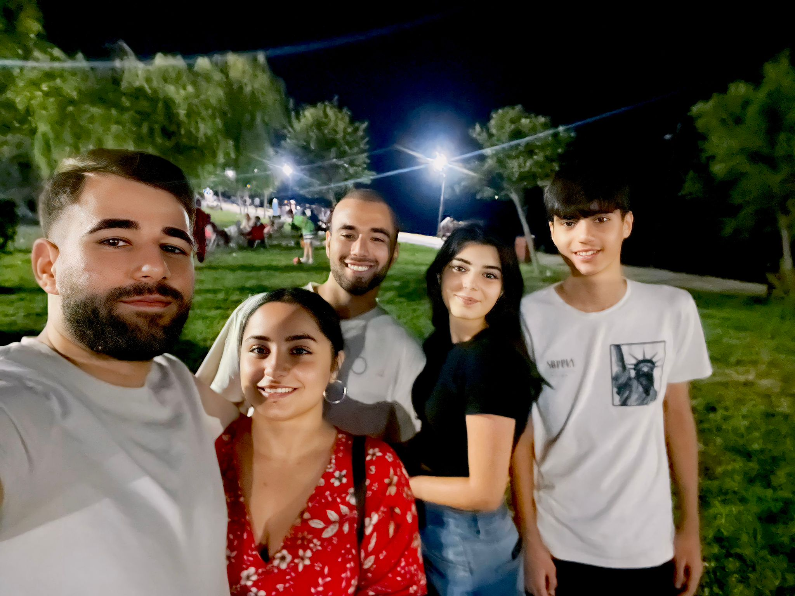
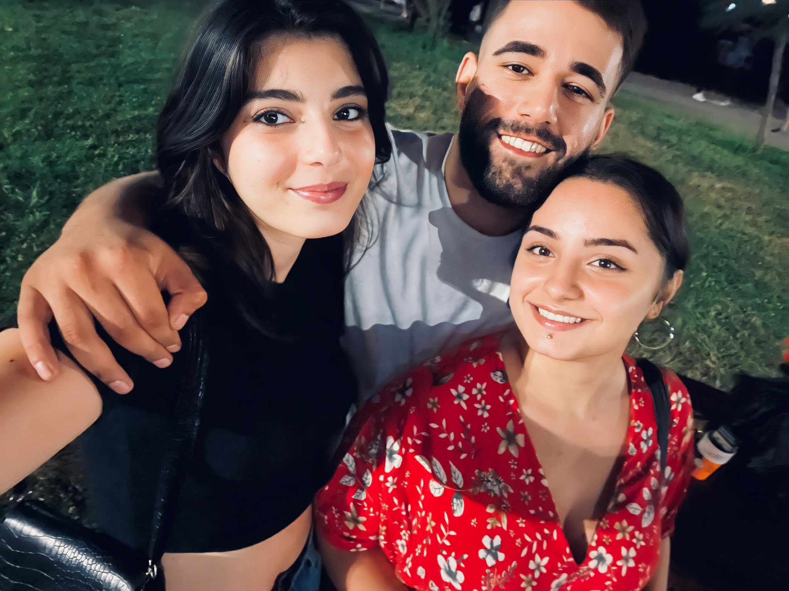
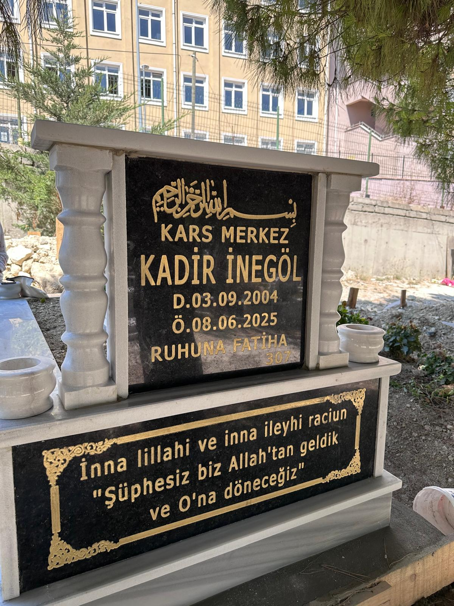

<!DOCTYPE html>
<html lang="tr">
<head>
  <meta charset="UTF-8">
  <meta name="viewport" content="width=device-width, initial-scale=1">
  <title>Kadir'i Rahmetle Anıyoruz</title>
  
</head>
<body>

  <header>
    <h1>Yanındayım, Hep Yanında Olacağım</h1>
    

      Hayat, zaman zaman bizi en sevdiklerimizden ayırarak derin izler bırakır. Böyle zamanlarda kelimeler yetersiz kalır, ama yanında olduğumu bilmeni istiyorum Aleyna. Kadir’in gidişi hepimizi derinden etkiledi, ama senin hissettiklerin, yaşadıkların elbette çok daha derin. O, sadece kuzenin değil; bir dostun, sırdaşın, çocukluğunun bir parçasıydı.   
      Üç ay geçti ama acı hâlâ taze. Bil ki bu süreçte elini hiç bırakmayacağım. Gözlerin dolduğunda yanında ben olacağım, sustuğunda sessizliğini dinleyeceğim. Bu küçük sayfa, onunla geçirdiğiniz o güzel anıları hatırlatmak ve onu rahmetle anmak için burada. Kadir’in ışığı sönmedi; sadece farklı bir yerde parlamaya devam ediyor.
    

  </header>

  <section class="gallery">

    <!-- Fotoğraf 1 -->
    

      
      

        "Zaman dursa, sadece o ana dönsek... Gülüşleriniz hafızamızda kaldı, kalbimizde hep yaşayacak. Kadir, seninle geçirilen her an bir hazineymiş."
      

    

    <!-- Fotoğraf 2 -->
    

      
      

        "Bazen bir kare, binlerce anı saklar içinde. Bu fotoğraf, sevgiyle kurulmuş bir bağın sessiz tanığı. Kadir, sen bu ailenin hiç unutulmayacak parçasısın."
      

    

    <!-- Fotoğraf 3 -->
    

      
      

        "O gün yüzünüzdeki gülümsemeler ne güzeldi... Şimdi o gülüşlerin ardında bir özlem saklı. Ama bil ki seni hiç unutmadık Kadir, hatıran hep bizimle."
      

    

    <!-- Fotoğraf 4 (Mezar) -->
    

      
      

        "Toprağın altında değil, dualarımızdasın. Mekânın cennet olsun Kadir... Seni sevenler asla unutmuyor, her zaman rahmetle anıyor."
      

    

  </section>

  <footer>
    © 2025 | Kadir'in Hatırasına
    

      Hazırlayan: Yasin Şahin
    

  </footer>

</body>
</html>
